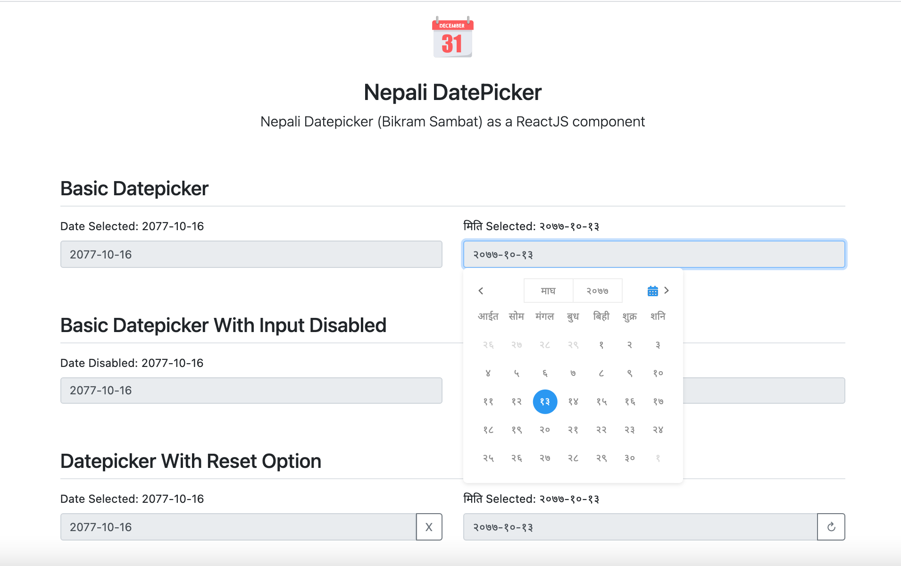

# Nepali Datepicker (Bikram Sambat) - React.js Component

> Nepali Datepicker (Bikram Sambat) as a ReactJS component

[](https://www.npmjs.com/package/nepali-datepicker-reactjs)
[](https://standardjs.com)
[](https://travis-ci.org/puncoz-official/nepali-datepicker-reactjs)
[](https://twitter.com/PuncozNepal)

## [Demo](https://puncoz-official.github.io/nepali-datepicker-reactjs/)



## Install

```bash
npm install --save nepali-datepicker-reactjs

or,

yarn add nepali-datepicker-reactjs
```

#### Options

-   `className` add custom class name to nepali date picker component.
-   `inputClassName` add custom class name to nepali date picker input element.
-   `value` is a string. By default the date will be set as undefined. If you provide `value=""`, then you get empty date as default date. And, you can provide any custom date as default selected. `Eg: <NepaliDatePicker value="2077-11-10" />` sets date to `2077-11-10`.
-   `onChange` is a callback function, executes on date change and returns the date.
-   `onSelect` is a callback function, executes on day select and returns the date.
-   `disabled` is a boolean. `true` disabled the datepicker select. By default the value is `false`.
-   `placeholder` is a string. By default the value is "कृपया मिति चयन गर्नुहोस्।", You can provide any custom text as a placeholder.
-   `showResetButton` - is a boolean. `true` shows the reset button along with datepicker and on click to button it resets the date to initial state. By default the value is `false`.
-   `resetButtonElement` - is an element. You can provide any text or icon or custom react component on it.
-   `options` - is an object containing config for datepicker and contains the following attributes:

```sh
  closeOnSelect: boolean
  calenderLocale: localeType
  valueLocale: localeType
```

> NOTE: localeType has value "`en || ne`".

-   `calenderLocale: en` shows you the calendar with english numbers and english months.
-   `calenderLocale: ne` shows you the calendar with nepali numbers and nepali months.
-   `valueLocale: en` return the selected date in english number format. Eg: `2077-11-23`
-   `valueLocale: en` return the selected date in nepali number format. Eg: `२०७७-११-२३`

## Implementation Example

```tsx
import React, { useState } from "react"
import { NepaliDatePicker } from "datepicker-nepali-reactjs"

const App = () => {
    const [nepaliDate, setNepaliDate] = useState<string>("")

    return (
        <form>
            <label htmlFor='date'>मिति:</label>
            <NepaliDatePicker
                inputClassName='form-control'
                className=''
                value={date}
                onChange={(value: string) => setDate(value)}
                options={{ calenderLocale: "ne", valueLocale: "en" }}
            />
        </form>
    )
}

export default App
```

## Bugs and Issues

Have a bug or an issue with this plugin? [Open a new issue](https://github.com/puncoz-official/nepali-datepicker-reactjs/issues) on GitHub.

## License

MIT © [https://github.com/puncoz-official](https://github.com/puncoz-official)
